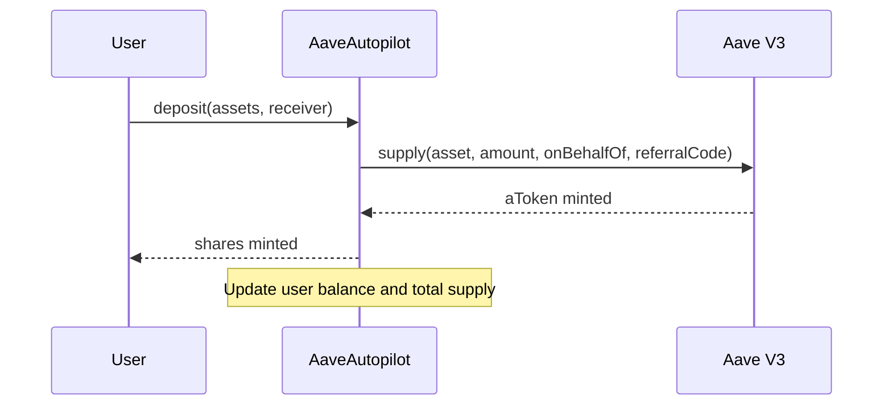
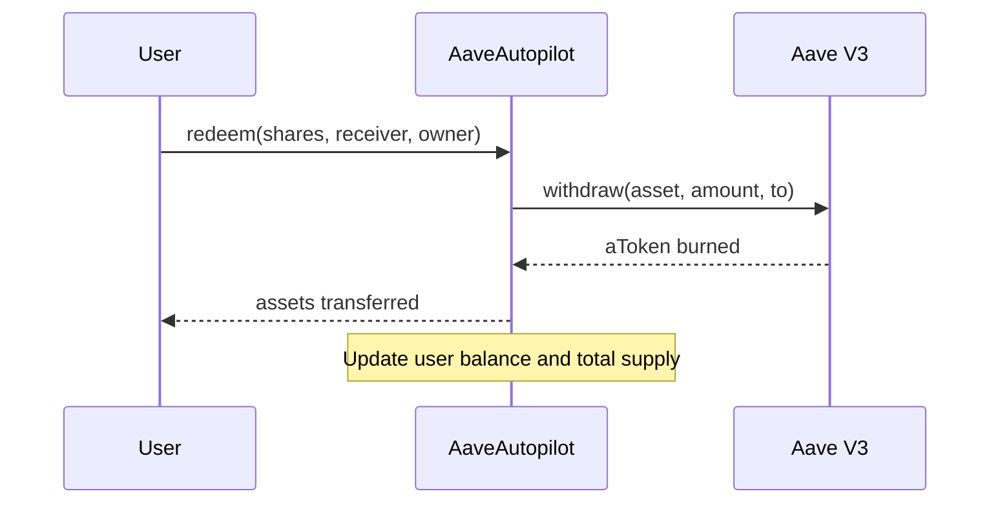
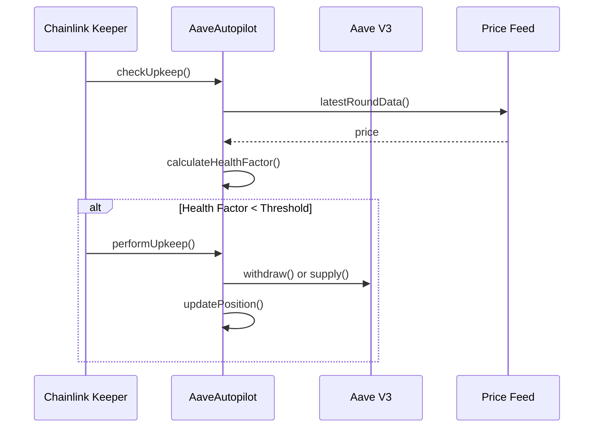

# 🏗️ Aave Autopilot Architecture

## System Overview

## System Architecture

### Overview

*Figure 1: High-level system architecture*

## Core Flows

### Deposit Flow

*Figure 2: Deposit flow sequence*

### Withdraw Flow

*Figure 3: Withdraw flow sequence*

### Rebalancing Flow

*Figure 4: Rebalancing flow sequence*

## Key Components

### 1. AaveAutopilot (ERC-4626 Vault)
- Manages user deposits/withdrawals
- Tracks user shares and assets
- Implements rebalancing logic
- Handles interest accrual through Aave V3

### 2. Chainlink Keepers
- Monitors health factor in real-time
- Triggers rebalancing when thresholds are breached
- Handles automation execution in a decentralized manner

### 3. Aave V3 Integration
- Interacts with Aave Pool for lending/borrowing
- Manages aToken balances
- Handles interest rate calculations

### 4. Price Oracle
- Uses Chainlink Price Feeds for accurate asset pricing
- Provides real-time price data for collateral valuation
- Ensures accurate health factor calculations

## Data Flow

### 1. Deposit Flow

### 2. Withdrawal Flow

### 3. Rebalancing Flow

## Security Considerations

- All external calls use OpenZeppelin's SafeERC20 for safe token transfers
- Reentrancy guards on all state-changing functions
- Access control for sensitive operations
- Comprehensive test coverage for all critical paths
